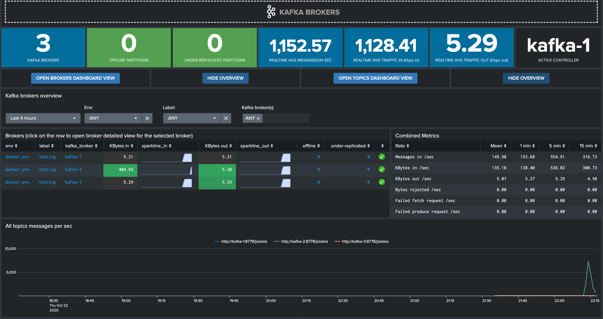
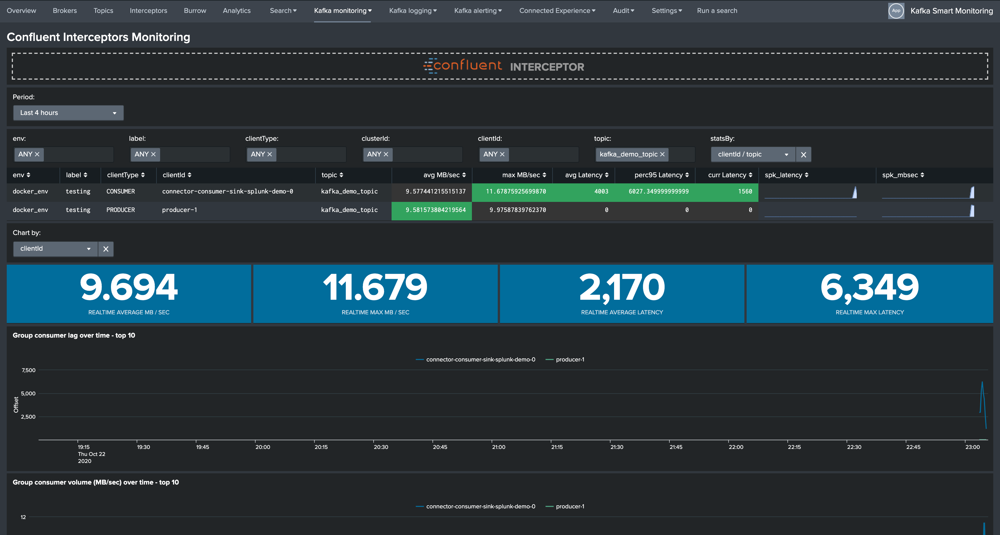

# kafka-docker-splunk

Copyright 2018-2020 Guilhem Marchand

Licensed under the Apache License, Version 2.0 (the "License");
you may not use this file except in compliance with the License.
You may obtain a copy of the License at

http://www.apache.org/licenses/LICENSE-2.0

Unless required by applicable law or agreed to in writing, software
distributed under the License is distributed on an "AS IS" BASIS,
WITHOUT WARRANTIES OR CONDITIONS OF ANY KIND, either express or implied.
See the License for the specific language governing permissions and
limitations under the License.

## purpose:

This repository contains docker-compose templates that will create ouf of the box a full Kafka Confluent OSS environment in Docker.

Its purpose is first of all to qualify, test and demonstrate the monitoring of a full Kafka/Confluent environment with Splunk.

**The following diagram represents the metrics data collection:**


**Two docker-compose.yml templates are provided in the following directories:**

[./template_docker_splunk_ondocker](./template_docker_splunk_ondocker/)

[./template_docker_splunk_localhost](./template_docker_splunk_localhost/)

The first template suffixed by "_ondocker" will run a Splunk standalone instance in Docker, while the second will attempt to send metrics to your local Splunk instance. (using the dockerhost container to communicate with your local guest machine)

In the case of the template running Splunk on Docker, the setup of Splunk (index definition, HEC token creation, installation of Kafka Smart Monitoring) is entirely automatic.

In both cases, the target for HEC telegraf metrics forwarding (your Splunk server running the HTTP Event Collector) and the token are variables loaded as environment variables in the Telegraf containers:

```
      SPLUNK_HEC_URL: "https://dockerhost:8088"
      SPLUNK_HEC_TOKEN: "205d43f1-2a31-4e60-a8b3-327eda49944a"
```

Shall you want to send the metrics to a third party destination and/or using a different token value, modify these values in the docker-compose.yml file.

For the purpose of the template, we hande as well the forwarding of the container logs running our Kafka components to Splunk using the Docker Splunk logging driver, such that both metrics and logs are provided to Splunk in a automated and easy way.

If you use the localhost template, you need to handle the HEC token definition, such as defined in the YAML file:

```
      splunk-token: "11113ee7-919e-4dc3-bde6-da10a2ac6709"
      splunk-url: "https://localhost:8088"

```

Consult the directories in [./splunk](./splunk/) to consult configuration files and examples.

If you use the ondocker template to run the Splunk instance in Docker, you do not need to do anything.

## Included containers

- Zookeeper cluster (3 nodes)
- Kafka broker cluster (3 nodes)
- Kafka connect cluster (1 node, can be extended up to 3 or more with additional config)
- Confluent schema-registry
- Confluent kafka-rest
- Confluent ksql-server
- Kafka Xinfra SLA monitor container
- Telegraf container polling and sending to your Splunk metric store
- Yahoo Kafka Manager (port exposed to localhost:9000)
- Confluent Interceptor console collector
- Kafka Burrow Consumer lag Monitoring (port exposed to localhost:9001, login: admin, password: ch@ngeM3)

In addition, these templates will run a few containers that will create a Kafka stream from Confluent example repositories, to create a consumer we can monitor and generate some activities in Kafka.

### Requirements

**To be able to use these templates, you need:**

- docker
- docker-compose

**Docker-CE is recommanded:**

- https://docs.docker.com/engine/install/ubuntu/

**To install docker-compose:**

- https://docs.docker.com/compose/install/

**Several ports are exposed to the localhost, and need to be available on the machine:**

- 12181 / 22181 / 32181 (Zookeeper)
- 19092 / 29092 / 39092 (Kafka Brokers)
- 18082 / 28082 / 38082 (Kafka Connect if up to 3 nodes)
- 18081 (schema-registry)
- 18088 (ksql-server)
- 18089 (kafka-rest)
- 9000 (kafka-manager)
- 9002 (Burrow)
- 7070 (kafka stream sample app)
- 8000 / 8089 / 8088 / 9997 (Splunk, only if using _ondocker template)

This can be resource intensive with if you run heavy benchmarks.

### Using the templates

**Start by cloning the repository:**

```
git clone git@github.com:guilhemmarchand/kafka-docker-splunk.git
```

**Then to start a template:**

```
cd template_docker_splunk_ondocker
./run.sh
```

Docker will download any image required, and the start the full environment.

**Splunk requires around 30 seconds to start, you can verify the instance state:**

```
docker-compose logs splunk
```

**Once Splunk has been started, you can access to Splunk Web:**

http://localhost:8000

- login: admin
- password: ch@ngeM3

Verify metrics ingestion in Splunk:

```
| mcatalog values(metric_name) as metric_name, values(_dims) where index=telegraf_kafka

```

Or using the msearch command:

```
| msearch index=telegraf_kafka filter="metric_name="*""
```

#### Kafka Smart Monitoring application

If you use a local or remote Splunk instance, download and install the application from Splunk Base:

https://splunkbase.splunk.com/app/4268/

If you use Splunk on Docker, the app is already installed for you.


#### Transfer files between host and the Splunk container

If you are using the _ondocker template, you can easily make files available to the container:

You can use the splunk/container_share directory to share files with the splunk docker container. (in /opt/splunk/container_share)

##### Performing a produce / consume demo with Kafka Connect and Splunk Connect for Kafka

**In addition with bootstraping a Kafka environment, you can easily use these templates to produce and consume data for testing or demo purposes.**

The following configuration is automatically made available to the Splunk instance you run it on Docker:

- ./splunk/TA-kafka-demo](./splunk/TA-kafka-demo)

This configuration defines a new HEC token and an index called "kafka_demo", if you use a local or remote Splunk instance, you need to deploy this or adapt the next commands.

**First, let's create a new Sink connector that will consume a topic and forward to Splunk, for the ease of the demo we use the HEC event endpoint:**

*Exec into the kafka-connect-1 container:*

```
docker-compose exec kafka-connect-1 /bin/bash
```

*For Splunk on Docker template*

```
curl localhost:18082/connectors -X POST -H "Content-Type: application/json" -d '{
"name": "sink-splunk-demo",
"config": {
   "connector.class": "com.splunk.kafka.connect.SplunkSinkConnector",
   "tasks.max": "3",
   "topics":"kafka_demo_topic",
   "splunk.hec.uri": "https://splunk:8088",
   "splunk.hec.token": "1f2e3966-14ad-11eb-9bfa-acde48001122",
   "splunk.hec.raw": "false",
   "splunk.hec.ssl.validate.certs": "false"
  }
}'
```

*For Splunk on localhost template*

```
curl localhost:18082/connectors -X POST -H "Content-Type: application/json" -d '{
"name": "sink-splunk-demo",
"config": {
   "connector.class": "com.splunk.kafka.connect.SplunkSinkConnector",
   "tasks.max": "3",
   "topics":"kafka_demo_topic",
   "splunk.hec.uri": "https://dockerhost:8088",
   "splunk.hec.token": "1f2e3966-14ad-11eb-9bfa-acde48001122",
   "splunk.hec.raw": "false",
   "splunk.hec.ssl.validate.certs": "false"
  }
}'
```

*Note: if you use a remote Splunk, adapth the splunk.hec.uri to match the IP address of the HEC endpoint, which must be accessible to the container!*

**We will use a builtin Kafka data generator to produce messages in the topic kafka_demo_topic:**

*Note: you will need to unset KAFKA_OPTS env variable to avoid a conflict with jolokia with is already running*

```
unset KAFKA_OPTS
```

**Add the class path to get Confluent Interceptors metrics too and run the data gen:**

```
export CLASSPATH=/usr/share/java/monitoring-interceptors/monitoring-interceptors-6.0.0.jar

/usr/bin/kafka-producer-perf-test --topic kafka_demo_topic --num-records 10000000 --record-size 1000 --throughput 10000 --producer-props bootstrap.servers="kafka-1:19092,kafka-2:29092,kafka-3:39092" interceptor.classes=io.confluent.monitoring.clients.interceptor.MonitoringProducerInterceptor acks=all
```

**Very quickly activity will appear in the Kafka environment, such as incoming and outgoing traffic, as well as consumer lag monitoring from Interceptors and every other metrics:**





**Events are indexed in Splunk:**

```
index=kafka_demo
```

**For more advanced data ingestion demo and testing, view:**

- https://github.com/guilhemmarchand/kafka-demo-cookbook

#### To destroy the environment:

To totally destroy the environment:

```
./destroy.sh
```
