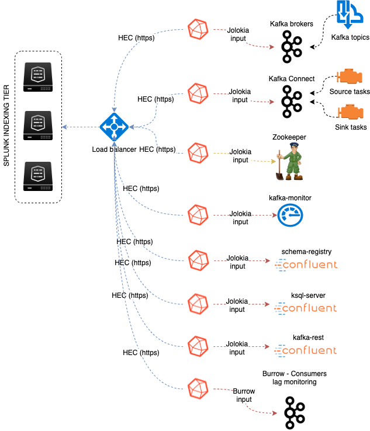
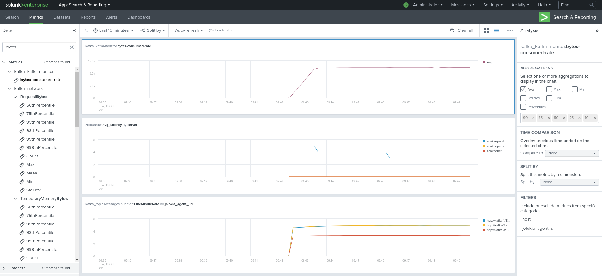
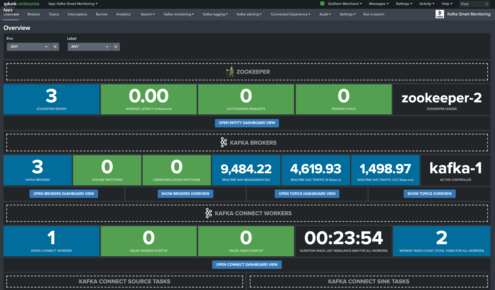
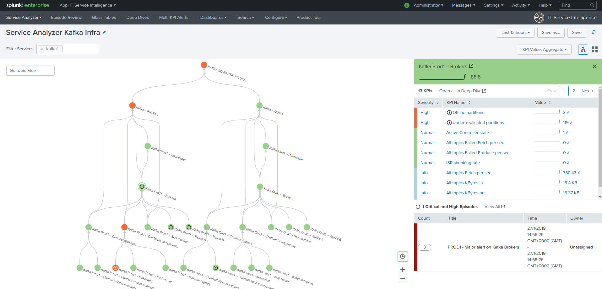

# kafka-docker-splunk

Copyright 2018-2019 Guilhem Marchand

Licensed under the Apache License, Version 2.0 (the "License");
you may not use this file except in compliance with the License.
You may obtain a copy of the License at

http://www.apache.org/licenses/LICENSE-2.0

Unless required by applicable law or agreed to in writing, software
distributed under the License is distributed on an "AS IS" BASIS,
WITHOUT WARRANTIES OR CONDITIONS OF ANY KIND, either express or implied.
See the License for the specific language governing permissions and
limitations under the License.

## purpose:

This repository contains docker-compose templates that will create ouf of the box a full Kafka Confluent OSS environment in Docker.

Its purpose is first of all to qualify, test and demonstrate the monitoring of a full Kafka/Confluent environment with Splunk.

The following diagram represents the metrics data collection:



Two docker-compose.yml templates are provided in the following directories:

[./template_docker_splunk_ondocker](./template_docker_splunk_ondocker/)

[./template_docker_splunk_localhost](./template_docker_splunk_localhost/)

The first template suffixed by "_ondocker" will run a Splunk standalone instance in Docker, while the second will attempt to send metrics to your local Splunk instance. (using the dockerhost container to communicate with your local guest machine)

In the case of the template running Splunk on Docker, the setup of Splunk (index definition, HEC token creation...) is entirely automatic.

In both cases, the target for HEC (your Splunk server running the HTTP Event Collector) and the token are variables loaded as environment variables in the Telegraf containers:

```
      SPLUNK_HEC_URL: "https://dockerhost:8088"
      SPLUNK_HEC_TOKEN: "205d43f1-2a31-4e60-a8b3-327eda49944a"
```

Shall you want to send the metrics to a third party destination and/or using a different token value, modify these values in the docker-compose.yml file.

## Included containers

- Zookeeper cluster (3 nodes)
- Kafka broker cluster (3 nodes)
- Kafka connect cluster (3 nodes)
- Confluent schema-registry
- Confluent kafka-rest
- Confluent ksql-server
- Kafka LinkedIn SLA monitor container
- Different Telegraf containers polling and sending to your Splunk metric store
- Yahoo Kafka Manager (port exposed to localhost:9000)
- Kafka Burrow Consumer lag Monitoring (port exposed to localhost:9001, login: admin, password: ch@ngeM3)

### Requirements

To be able to use these templates, you need:

- docker
- docker-compose

### Using the templates

Start by cloning the repository:

```
git clone git@github.com:guilhemmarchand/kafka-docker-splunk.git
```

Then to start a template:

```
cd template_docker_splunk_ondocker
./run.sh
```

Docker will download any image required, and the start the full environment.

Splunk requires around 30 seconds to start, you can verify the instance state:

```
docker-compose logs splunk
```

Once Splunk has been started, you can access to Splunk Web:

http://localhost:8000

- login: admin
- password: ch@ngeM3

Verify metrics ingestion in Splunk:

```
| mcatalog values(metric_name) as metric_name, values(_dims) where index=telegraf_kafka
```

#### Metrics Workspace application

Install the Metrics Workspace application in Splunk:

https://splunkbase.splunk.com/app/4192/



The Metrics Workspace application is not mandatory at all, but it very useful and convenient to explore and visualize available metrics in a friendly and efficient UI.

#### Kafka Smart Monitoring application

Once your environment is up, download the Kafka Monitoring Application, install from Splunk Web UI, ideally restart Splunk via the UI and appreciate a fully ready, up and running monitoring solution.

https://splunkbase.splunk.com/app/4268/



#### Transfer files between host and the Splunk container

If you are using the _ondocker template, you can easily make files available to the container:

You can use the splunk/container_share directory to share files with the splunk docker container (in /opt/splunk/container_share) for ease.

This is specially useful if you want to run ITSI.

#### ITSI module for Kafka Smart Monitoring

If you deployed ITSI, or if you are running ITSI on the Splunk target instance, download and install the Kafka module:

https://splunkbase.splunk.com/app/4261/

Restart Splunk after the installation, you can start creating the entities using the builtin entities discovery, and create services with the builtin service templaces.



#### To destroy the environment:

Finally, you can totally destroy the environment:

```
./destroy.sh
```

#### What about event logging?

This repository does not manage the indexing of event logs from the different components, the aspects are entirely taken in charge by the Kafka Smart Monitoring application, and the ITSI Module for Kafka Smart Monitoring.

See for more information:

https://splunk-guide-for-kafka-monitoring.readthedocs.io

https://github.com/guilhemmarchand/splunk-guide-for-kafka-monitoring/

#### Traditional dedicated, Kubernetes, real-world configuration and Production ready

The purpose of these templates is to demonstrate and/or build a easy quick lab in a minute.

Real World instructions and templates for a Production ready deployment, be in Kubernetes or traditional dedicated servers, are covered in the following repository:

https://github.com/guilhemmarchand/splunk-guide-for-kafka-monitoring/
